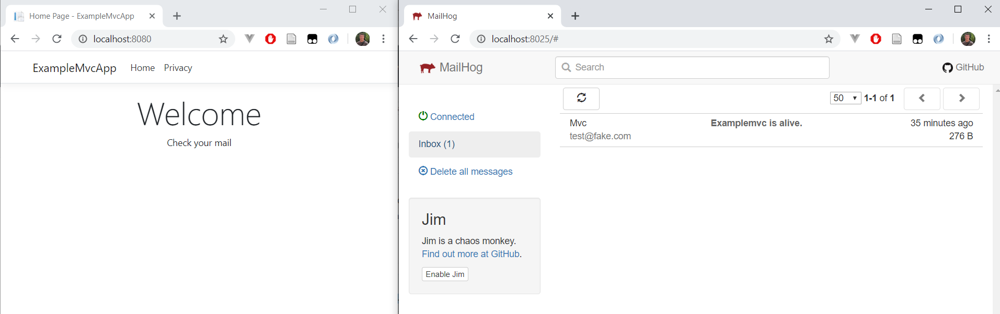

# ExampleWebApp

## Summary
* **Course**: Continuous Integration Advanced
* **Chapter**: CIA 01 Docker en ASP.Net Core
* **Example #**: 2

## Branches
* **01multistage**: 
* **02dockercompose**:
* **03multiplecontainers** or **master**:


## Use

### 01multistage
* create image: 
````
docker build -t examplemvcapp .
````
* run container: 
````
docker run --rm -it -p 8080:80 examplemvcapp
````

* view result: 


### 02dockercompose
* run container: 
````
docker-compose up
````


### 03multiplecontainers
* rebuild image and spin up 2 containers 
````
docker-compose up -d --build
````

* view result: 


&copy; Graduaat Programmeren / Associate Degree Programming
**Howest**
  