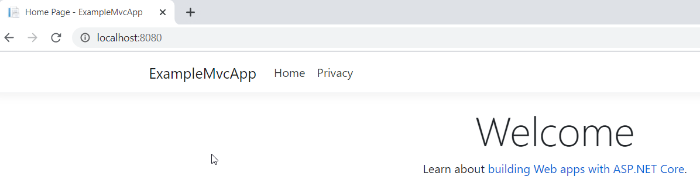

# ExampleWebApp

## Summary
* **Course**: Continuous Integration Advanced
* **Chapter**: CIA 01 Docker en ASP.Net Core
* **Example #**: 2

## Branches
* **master**: working example

## Use

* create image: 
````
docker build -t examplemvcapp .
````
* run container: 
````
docker run --rm -it -p 8080:80 examplemvcapp
````

* view result: 





&copy; Graduaat Programmeren / Associate Degree Programming
**Howest**
  